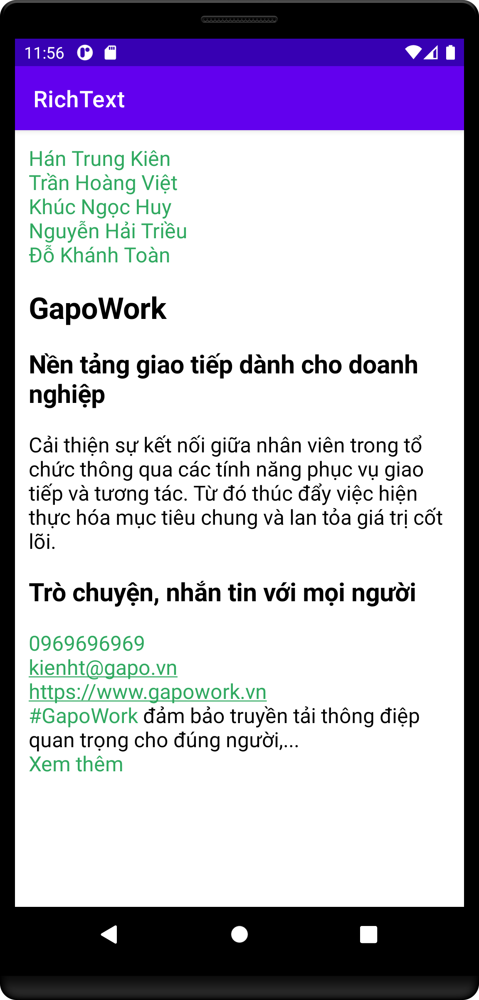

# RichText

**RichText** supports Hashtag(#), Mention, Url, Phone Number, Email, Markdown, Custom Span,
SeeMore/SeeLess by line or length, and ability to handle clicks and long clicks on Spanned content.



## Installation

Gradle

```gradle
allprojects {
    repositories {
        maven { url 'https://jitpack.io' }
    }
}

implementation 'com.github.hantrungkien:richtext:1.0.0-alpha01'
```

## Usage

[Example](/app/src/main/java/com/kienht/richtext/example/MainActivity.kt):

```kotlin
val color = Color.parseColor("#30A960")

val richText = RichText.Builder()
    .setOriginal(text)
    .addSpanner(
       RichTextMetadataSpanner.Params()
           .setForegroundColor(color)
           .setUnderline(true)
           .setMetadataParser(RichTextHashtagMetadataParser)
           .setOnClickListener(
               object : RichTextOnClickSpanListener {
                   override fun onClickSpan(view: View, metadata: RichTextMetadata) {
                       Log.e("TAG", "onClickSpan: = $metadata")
                   }

                   override fun onLongClickSpan(
                       view: View,
                       metadata: RichTextMetadata
                   ) {
                       Log.e("TAG", "onLongClickSpan: = $metadata")
                   }
               }
           )
           .create()
    )
    .build()

binding.textView.movementMethod = RichTextLinkMovementMethod.instance
binding.textView.text = richText.spannable
```

## Supported Cases
- Hashtag: `#hashtag`
```kotlin
.addSpanner(
    RichTextMetadataSpanner.Params()
        .setMetadataParser(RichTextHashtagMetadataParser)
        .create()
)
```
- Mention: `@mention`
```kotlin
val mentionMetadata = listOf(
    RichTextMetadata("kienht", 0, 14),
    RichTextMetadata("vietth", 15, 30),
)
.addSpanner(
    RichTextMetadataSpanner.Params()
        .setMetadata(mentionMetadata)
        .create()
)
```
- URL
```kotlin
.addSpanner(
    RichTextMetadataSpanner.Params()
        .setMetadataParser(RichTextUrlMetadataParser)
        .create()
)
```
- Phone Number
```kotlin
.addSpanner(
    RichTextMetadataSpanner.Params()
        .setMetadataParser(RichTextPhoneNumberMetadataParser)
        .create()
)
```
- Email
```kotlin
.addSpanner(
    RichTextMetadataSpanner.Params()
        .setMetadataParser(RichTextEmailMetadataParser)
        .create()
)
```
- Markdown

```gradle
implementation "io.noties.markwon:core:latest_version"
```

```kotlin
private val markwon by lazy(LazyThreadSafetyMode.NONE) {
    Markwon.builder(this)
        .usePlugin(object : AbstractMarkwonPlugin() {
            override fun configureTheme(builder: MarkwonTheme.Builder) {
                builder
                    .bulletWidth(8)
                    .headingBreakHeight(0)
                    .headingTextSizeMultipliers(floatArrayOf(1.43f, 1.21f, 1f, 1f, 1f, 1f))

                builder.headingTypeface(Typeface.DEFAULT_BOLD)
            }
        })
        .usePlugin(SoftBreakAddsNewLinePlugin.create())
        .usePlugin(StrikethroughPlugin.create())
        .usePlugin(TablePlugin.create(this))
        .usePlugin(TaskListPlugin.create(this))
        .build()
}
.addSpanner(RichTextMarkdownSpanner(markwon))
```

- SeeMore/SeeLess: Support length and line
  type  [RichTextSeeMoreType](/richtext/src/main/java/com/kienht/richtext/spanner/seemore/RichTextSeeMoreType.kt)
```kotlin
val seeMore = " ...Xem thêm"

val richText = RichText.Builder()
    .setOriginal(text)
    .addSpanner(...)
    .setSeeMoreType(
        RichTextSeeMoreType.Line(
            seeMore = RichTextMetadataSpanner.Params()
                .setForegroundColor(color)
                .setMetadata(listOf(RichTextMetadata(seeMore, 4, seeMore.length)))
                .create()
                .span(seeMore),
            line = 24,
            measurementParams = RichTextMeasurement.Params.Builder().from(binding.text).build()
        )
    )
binding.textView.text = richText.seeMoreSpannable
```